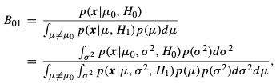
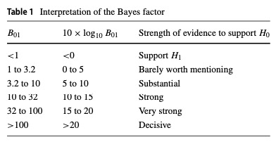

# Bayes factor in one-sample tests of means with a sensitivity analysis

Du, H., Edwards, M.C., Zhang, Z.Y., (2019). Bayes factor in one-sample tests of means with a sensitivity analysis: A discussion of separate prior distributions. *Behavior Research Methods, 51*: 1998–2021. DOI: [10.3758/s13428-019-01262-w](https://doi.org/10.3758/s13428-019-01262-w)

[toc]

## Background

Previous research about the influence of the prior focuses on the prior for the effect size and there is a debate about how to specify the prior. 

Purpose: explore the impact of different priors on the population mean and variance separately (separate priors) on the Bayes factor, and compare the separate priors with the priors on the effect size. 

#### Limitations of *p* value

- cannot give evidence on the likelihood of null hypothesis
- rely on the sample size when the null hypothesis is false, however, increasing the sample size cannot strengthen the support of the null hypothesis, since the p-value is uniformly distributed between 0 and 1 regardless of the sample size when the null hypothesis is true
- frequentist hypothesis testing is based on long-run frequency, thus leads to problems such as violation of the likelihood principle (Berger & Wolpert, 1984; Dienes, 2011).

**long-run frequency (Dienes, 2011)**

“A long-run relative frequency requires an indefinitely large series of events that constitutes the collective (von Mises, 1957); the probability of some property (q) occurring is then the proportion of events in the collective with property q. 

The logic of Neyman Pearson (orthodox) statistics is to adopt decision procedures with known long-term error rates (of false positives and false negatives) and then control those errors at acceptable levels.

These error rates apply to decision procedures, not to individual experiments. An individual experiment is a one- time event, so it does not constitute a long-run set of events, but a decision procedure can in principle be considered to apply over an indefinite long-run number of experiments.“

#### Bayes Factor

##### Purpose: How to choose prior distributions in one-sample tests of means?

- explore the impact of different separate priors on the Bayes factor
- compare the separate priors with the priors on the effect size
- explore how to specify reasonable prior distributions for the Bayes factor by a sensitivity analysis. 

Due to the Jeffreys–Lindley paradox (Noninformative priors bias the Bayes factor in support of the null hypothesis), we should consider informative prior or weakly informative prior that has a reasonable range/variance.

##### Default Prior

dose not influence the Bayes factor. 

*scaled-information prior* placed a normal prior distribution on the standardized group mean difference and a Jeffrey prior on the common variance (when the variance of the normal prior is 1, the prior is called the *unit-information prior*). the choice of default prior can be calibrated based on some criteria: the true effect size, error rates(1− p (Bayes factor support H0 |H0 : effect size = 0) = 0.05)

*Rouder et al. (2009)*: a Cauchy prior distribution on the standardized group mean difference (used in BayesFactor package) 

- Cauchy(0,1): the prior belief is that 50% of the effect size values are inside the interval (−1, 1) and 50% of the effect size values are outside the interval. 
- However, large effect size which is provides with large weight in this prior is implausible in social science. 
- Morey et al. (2016) suggested that the default prior is a family of prior, and different scale parameter values can be specified ($\sqrt{(2)}/2,1,\sqrt{(2)}$). 
- Borsboom, and van der Maas (2011) and Wetzels et al. (2011) suggested that Cauchy(0,1) could serve as a starting point followed by a sensitivity analysis with different scale parameter values. 

- Ly, and Wagenmakers (2017) proposed to use a flexible t prior that can incorporate expert knowledge about standardized effect size to construct informed Bayes factors. The default prior by Rouder et al. (2009) is a special case of the t prior. 
- default prior has been extended to other linear regression models

##### Separate Prior 

is not a general setting in Bayes factor calculation, it is a general option in posterior distribution inference

different sets of independent separate priors that are not mathematically equivalent to the normal prior on the effect size

$\mu$

- Normal prior: $N(c_{\mu},a^2)$, a is set at a large value (e.g., 104) for a noninformative prior. 

- Uniform prior: $U(c_{\mu}-a,c_{\mu}+a)$

$\sigma^2$

- Uniform prior on $log(\sigma^2)$: $U(-b,b)$, $p(\sigma^2)=1/(2b\sigma^2)$
- Inverse-gamma distribution: $IG(shape = \alpha, sclae=\beta)$ The uniform prior on $log(\sigma^2)$ can be viewed as I G(0, 0).  In this paper, $IG(b,b)$ b is set to a small value such as 0.1, 0.01, 0.001 to construct a noninfor- mative prior

- Uniform prior on $\sigma$: $U(c_{\sigma}-b/2, c_{\sigma}+b/2)$ $p(\sigma^2)=1/(2b\sigma)$

Previous Bayes factor literature mainly focused on the dimensionless effect size, with the same sample size and effect size, the Bayes factor is more conservative compared with the frequentist hypothesis testing using the p-value

##### Princinple of Bayes factor

The Bayes factor can be viewed as the ratio of marginal likelihoods which are the weighted average likelihoods over the parameter spaces under the null hypothesis and the alternative hypothesis, respectively 

The prior density determines the weights in the weighted average likelihood. calculating the marginal likelihood is equivalent to a process where we repeatedly draw a parameter from its prior distribution, calculate the likelihoods given the drawn values of the parameter, and calculate the average of the likelihoods.

Bayes factor in a one-sample test of means:

When the prior distributions fail to cover the true parameter space (e.g., the ranges are too narrow and the centers of prior distributions severely deviate from the true values), the integration would fail to provide the “true” marginal likelihoods. 

**Three types of hypothesis testing**

- $H_0:\mu=\mu_0, H_1:\mu=\mu_1$
- $H_0:\mu=\mu_0, H_1:\mu \neq \mu_0$ (used in this paper)
- $H_0:\mu \subset \Theta_0, H_1:\mu \subset \Theta_1$

## Hightlights in the Simulation Study

*confident true prior* in the simulation study: informative prior that covers the specified true parameter

*confident wrong prior* fails to cover or barely covers

priors: scaled-information prior, cauchy prior, seperate priors

Bayes factor is calculated via a Monte Carlo simulation with $10^4$ replications. 

- **Impact of different prior distributions**

the priors with a ≥ 10 could cause the Jeffreys– Lindley paradox, thus they are not recommended.

The priors that are very informative are also not recommended (i.e., a = 0.1), because in practice we do not know whether the priors are confident true priors or confident wrong priors

moderately different prior information barely influences the Bayes factor conclusion

- **Impact of prior distribution of the variance**

not only the prior distribution (different types of the distributions and hyperparameter values) on μ but also the prior distribution on σ2 has an influence on the Bayes factor. 

generally, the more noninformative the prior distribution on μ or σ2 is,  the smaller B10 is, but the influence of the prior on σ2 has a limit.

- **Impact of effect size**

$\mu = 0.2$ : The frequentist conclusion is that the null hypothesis is not rejected, which is consistent with the Bayesian conclusion that the median Bayes factors do not support the alternative hypothesis, except when the confident wrong priors are used.

- **seperate priors vs scaled-information prior, cauchy prior**

In many cases, using the priors on the effect size provides similar Bayes factor with using separate priors. 

But using a uniform prior on σ (Conditions 3 and 6) could lead to different Bayes factors compared with the priors on effect size. Thus, a uniform prior on σ should be considered if a sensitivity analysis is needed.

## Hightlights in Example

sensitivity analysis

consider the same six sets of separate priors on the population mean (μ) and variance (σ 2 ) and two sets of priors on the effect size (δ) that are used in our earlier simulation. 

some support the alternative hypothesis and some support neither of the hypotheses. It implies that it is risky to use the informative priors in real data since they can easily be confident wrong priors, which we never know.

Consistent with the simulation results, when the priors are relatively noninformative, the Bayes factors always support the null hypothesis. 

**The process of conducting sensitivity analysis is relatively subjective.** Sensitivity analysis help us better understand the influence of prior distributions on each dataset, regardless which types of priors are used.

Furthermore, how to specify the hyperparameters is not a special problem in the separate priors, but also a problem in priors on the effect size. 

## Discussion

Although some previous research suggested that the prior distribution on σ 2 should have the minimal influence on the Bayes factor, the simulations presented in this paper show that the prior distribution for σ2 could have a substantial influence on the Bayes factor. 

There are two reasons. First, Rouder et al. (2009) assumed that the extreme σ2 from the prior distribution should have an equal influence on the marginal likelihoods of both the null and alternative hypotheses. Different prior distributions on σ2 (different types or different hyperparameters) yield different marginal likelihoods.  Second, the discussed prior in the literature on σ2 is a Jeffrey prior. The hyperparameter is kind of fixed in $p(\sigma^2)\propto 1/\sigma^2$. Additionally, the family of separate priors moderates the impact of the sample size and the population effect size on the Bayes factor. 

## My Thoughts

Maybe the Bayes factor can be applied in Bayesian approximate measurement invariance to determine the amount of non-invariance.

Maybe the separate priors can be assigned for the differecence in parameters in the measurement invariance analysis since we focus on the posterior distribution in these models.

<ul class="actions">
<li><a href="https://www.lijinzhang.xyz/blog_200520_summary.html" class="button">Return</a></li>
</ul>			

