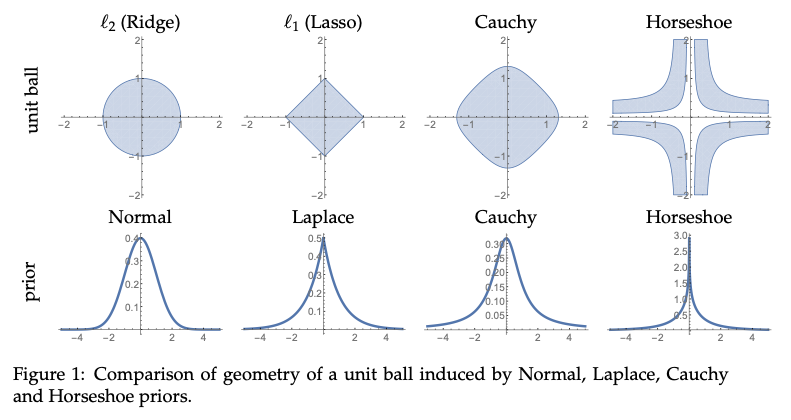

# Bayesian Regularization: From Tikhonov to Horseshoe

Polson, N. G., & Sokolov, V. (2019). Bayesian Regularization: From Tikhonov to Horseshoe. *ArXiv:1902.06269 [Stat]*. http://arxiv.org/abs/1902.06269

[TOC]

## Introduction

regularization: 

- solution to the high-dimensional sparse signal recovery problems
- a machine learning technique that allows for an optimal trade-off be- tween model complexity (bias) and out-of-sample performance (variance)
- can be viewed as constraint on the model space
- Proposal of these methods: were originally applied to solve ill-posed problems where a slight change in the initial data could significantly alter the solution
- Mathematically, one can to think of defining a regularized solution by constraining the topology of a search space to a ball.

It had long been believed that ill-conditioned problems offered little practical value, until Tikhonov published his seminal paper (Tikhonov, 1943) on regularization. 

Ridge: Hoerl & Kennard (1970)

Lasso: Williams (1995) assigned Laplace prior, Tibshirani (1996) frequentist

## Bayesian Regularization

Risk: not exactly zero

simple thresholding rule beats James-Stein this with a risk given by 􏰏log *p*. This simple example, shows that the choice of penalty should not be taken for granted as different estimators will have different risk profiles.

it is not possible in general case to calculate the integrals, instead,  an efficient numerical techniques for calculating samples from posterior distributions are required, e.g., Gibbs sampler.

Laplace prior and scale normal mixture prior:

- Carlin and Polson (1991); Carlin et al. (1992); Park and Casella (2008) used representation of Laplace prior is a scale Normal mixture to develop a Gibbs sampler that iteratively samples from *β* | *a*, *y* and *b* | *β*, *y* to estimate joint distribution over (*β*, *b*). 

SSP: problems of minimizing the negative log-posterior 

- Note, that the problem of minimizing the negative log-posterior is a mixed integer program with each *γ*1 being constraint to take values 0 or 1. This optimization problem is NP-hard, e.g. we cannot solve it efficiently for any meaningful value of *p*. Efficient algorithms for MAP esti- mation for high dimensional linear models were proposed in Moran et al. (2018); Rocˇkova ́ and George (2018). 

Horseshoe: problems of MH MCMC algorithm

- The funnel shape geometry of the horseshoe prior is makes it challeng- ing for MCMC to efficiently explore the parameter space.
- Solution: other algorithms, One approach is to replace the thick-tailed half-Cauchy prior over *λ**j* with half-t priors using small degrees of freedom.

## Conclusion

Advantages of Bayesian regularization

- It **allows for a more flexible set of models** that closely match the data generating process, and assumptions appear explicitly in the model.
- Bayesian sampling algorithms are flexible enough and existing libraries can easily handle a wide range of model formulations without the need to design custom al- gorithms and implementations
- Bayesian estimates are **optimal on the bias-variance scale**. The parameters of the prior distribution (penalty function parameters) can be estimated using the training data set (*X*, *y*) (Kitagawa and Gersch, 1985) rather using brute-force search.
- Bayesian estimation procedures **result in distributions over parameters** and enable improved analysis of uncertainty in estimates and predictions.
- Ability to incorporate prior information based on expert opinion or previously observed data.

<ul class="actions">
<li><a href="https://www.lijinzhang.xyz/blog_200520_summary.html" class="button">Return</a></li>
</ul>			

