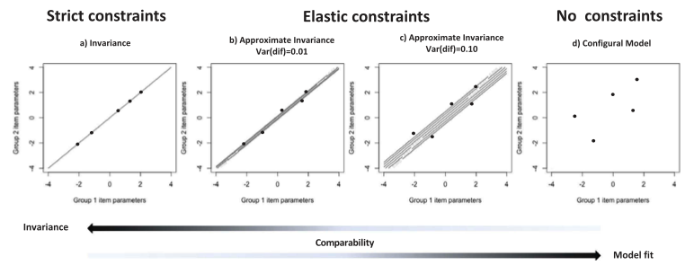

# Choosing priors in Bayesian approximate measurement invariance

Pokropek, A., Schmidt, P., Davidov, E., (2020). Choosing Priors in Bayesian Measurement Invariance Modeling: A Monte Carlo Simulation Study, Structural Equation Modeling: A Multidisciplinary Journal, DOI: [10.1080/10705511.2019.1703708](https://doi.org/10.1080/10705511.2019.1703708)

[toc]

## Background

**Bayesian approximate measurement invariance:**  allows small “harmless” differences in factor loadings and item intercepts across different groups that do not bias substantive conclusions when performing multiple-group modeling. 

### Prior Selection Strategy (Asparouhov, Muthén, & Morin, 2015): 

Muthén and Asparouhov (2012) suggested that in the search for an appropriate prior, one should begin with the simplest model (with a prior that equals zero) and then gradually increase its prior until a significant improvement of the model fit is achieved. 

Start with very small prior variances (e.g. 0.001) , and then increasing the prior variance multiple times consecutively. This strategy is grounded on a “subjective selection” based on monitoring two criteria:

(1) speed of convergence (number of iterations) and
 (2) ninety-five percent confidence interval for the difference between the observed and the replicated chi-square values.

Asparouhov, T., Muthén, B., & Morin, A. J. (2015). Bayesian structural equation modeling with cross-loadings and residual covariances: Comments on Stromeyer et al. Journal of Management, 41, 1561–1577. doi:[10.1177/0149206315591075](https://journals.sagepub.com/doi/10.1177/0149206315591075)

### Model Fitting Indexes

Other authors suggested to focus more on comparative fit indices like the Bayesian information criterion (BIC) and the deviance information criter- ion (DIC) (Stromeyer, Miller, Sriramachandramurthy, & DeMartino, 2015) or other fit measures like Bayesian root mean square error of approximation (BRMSEA) (Hoofs, van de Schoot, Jansen, & Kant, 2018) when deciding which priors to choose. 

When using informative priors, establishing the number of parameters is problematic (Spiegelhalter et al., 2002). AIC and BIC can unnecessarily penalize the Bayesian approximate measurement invariance  model by counting small-variance prior parameters as actual parameters and thereby overshadowing or obscuring information provided by the model. 

**Purpose:** Provide guidance on how to evaluate the fit of Bayesian approximate measurement invariance models.

### The implementation of Bayesian approxiamte measurement invariance analysis in Mplus

In Mplus, item parameters receive uninformative priors with a zero mean and a large variance (e.g., $Prior(\tau_{11})~N(0,1000)$, $Prior(\tau_{12})~N(0,1000)$).

Elastic constraints (i.e. the difference variance priors) are imposed by setting a high covariance between two prior distributions, for instance: COV [$Prior(\tau_{11})$, $Prior(\tau_{11})$ ] = 999.995. 

$$
V(a-b)=V(a)+V(b)-2COV(a,b)
$$

The prior variance for the differences between item parameters becomes 1000 + 1000 – 2*999.995 = 0.01.

## Data Generation

Prior variance: 0, 0.001, 0.005, 0.01, 0.025, 0.05

Number of groups (sample size per group): 4 (400), 24 (1500), 30 (3000). The settings of the number of groups are based on previous empirical studies.

Factor means: sampled means and standard deviations for each group from normal distributions $N(0,0.3)$ and $N(1,0.1)$

Loadings: (1) uniform distribution bounded by a mean of 0.6 to 0.7, (2) then, added approximate non-invariance (based on the prior variance) bias to the item parameters. 

Study 1: illustrate how different prior specifications affect the results of MG-BSEM analysis

Study 2: examine the effectiveness of procedures that aims to tune the normal prior varianceof the group differences in MG-CFA models using model selection criteria. 

## Highlights Results

Study 1

results demonstrate the ability of the models to recover the true latent means and standard deviations, the true latent mean rankings, and the means’ coverage in each condition. 

results determines the real importance of a “correct” prior specification is allowing a correct estimation of CIs 

Study 2

A stepwise model selection strategy starting from a model with a zero prior, and we compared this model with a model with a higher prior (i.e. 0.001). 

If the fit (BIC, DIC, PPP) of the model with the higher prior (i.e. 0.001) was better, we continued and compared it to a model with an even higher prior (i.e. 0.005) and so on. A model was chosen when the improvement of fit in terms of BIC, DIC, and PPP did not exceed a certain threshold. 

Both the PPP and DIC performed better when the size of the study increased (DIC slightly better than ppp). Given their better performance compared to the BIC, in real applications it seems advisable to use both the PPP and DIC in combination for determining the appropriate prior. 

## Discussion

More model fitting indexes: Bayesian modeling is not restricted to these three measures of fit (BIC, DIC, PPP), and other well-established indices exist, such as the leave-one-out cross-validation (LOO) (Vehtari, Gelman, & Gabry, 2017), the widely applicable information criterion (WAIC; Vehtari et al., 2017), or the data agreement criterion (DAC; Bousquet, 2008; Lek & van de Schoot, 2019). 

## My Thoughts

The sample size per group is too high to be realistic in practice, no wonder the accurate estimates were obtained mostly in study 1. 

Based on the results of my research, the prior selection strategy can be misleading sometimes. For example, when 0.01 prior variance cannot get the good model fitting whereas the 0.05 can, perhaps the noninvariance (0.05) is too large to get accurate estimates.

This prior selection strategy are more appropriate to determine the noninvariance of loadings and intercepts rather than the priors. Because when the noninvariance is too large, no priors can obtain accurate estimaes unless the sample size is extremely large.

More model fitting indexes: Bayesian version of CFI, TIL and so on.

<ul class="actions">
<li><a href="https://www.lijinzhang.xyz/blog_200520_summary.html" class="button">Return</a></li>
</ul>			

