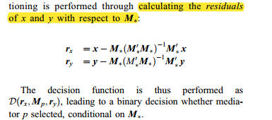
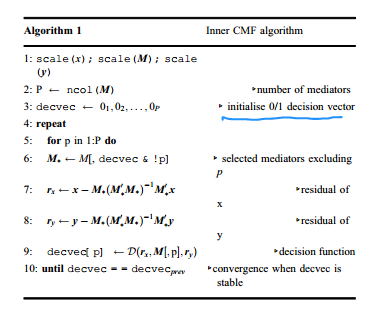
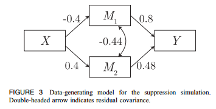
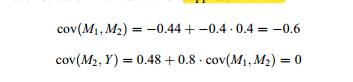
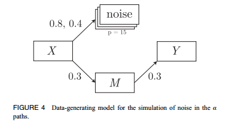
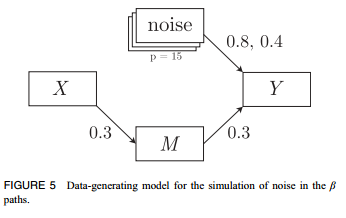
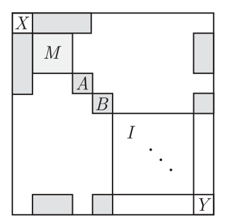
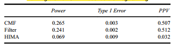
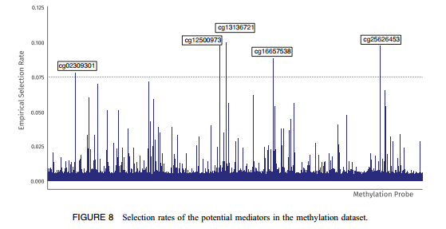

# Exploratory Mediation Analysis with Many Potential Mediators 

van Kesteren, E.-J., & Oberski, D. L. (2019). Exploratory Mediation Analysis with Many Potential Mediators. *Structural Equation Modeling: A Multidisciplinary Journal*, *26*(5), 710–723. <https://doi.org/10.1080/10705511.2019.1588124>

[TOC]

a hybrid approach which uses components of both filter and regularization 

## Introduction

### Problem when $N>P$

Data: increasingly employing technologies such as fMRI, smartphones, and gene sequencing, which yield ‘high-dimensional’ datasets with more columns than rows. 

In this situation, the observed covariance matrix is rank-deficient, leading to linear dependence in the observed moments and, for the full mediation model, non-convergence. 

### Estimation

- Filter method (Preacher & Hayes, 2008)

A pitfall of this is that a variable useless by itself can be useful together with others (Guyon & Elisseeff, 2003).  

the selected subset will not include mediators that are relevant only conditionally on another mediator. 

- SEM method

when $N>P$, there is no maximum likelihood solution

- XMed

do perform conditional estimation, but they select paths rather than mediators:

The disadvantage is that this method finds paths with a large effect rather than the desired subset of mediators: the regularization in XMed shrinks small β paths to 0, irrespective of the value of their associated α paths – shrinkage is performed on all paths equally.  

inflated false-positive rates as reported by Serang et al. (2017) and Jacobucci, Brandmaier, and Kievit (2018). 

- HIMA

three steps: 1) marginally filter irrelevant potential mediators based on the M -> Y relations.  2) the remaining M ! Y paths are estimated with regularization 3) performs the joint significance test as introduced by Baron and Kenny (1986) with Bonferroni correction on the remaining mediators 

have the disadvantages of both the Filter and XMed method

- “Coordinate-wise Mediation Filter” (CMF) 

This paper

(a) it converges in case of high-dimensional data

(b) it takes into account mediator correlations, leading to the conditional selection of mediators

(c) it selects based on mediation, not paths. 

CMF performs univariate filtering conditional on the other selected mediators by using an algorithm from regularized regression: cyclical coordinate descent on residuals 

## CMF

### Inner algorithm

for each potential mediator Mp, create a data matrix M, which contains all the mediators currently selected

excluding the variable Mp under consideration

calculating the residuals of x and y with respect to M*

The inner algorithm is run continuously, randomly ordering the choice of p in each iteration. 

It stops either when the mediator selection does not change from one step to the next or when the prespecified maximum number of iterations is reached.  

### Outer algorithm

the inner algorithm depends to some extent on the starting values 

Therefore, the algorithm is embedded in an outer loop that performs multiple random starts. 

Feature sampling: the inner algorithm will loop over only $sqrt(P)$ potential mediators at each iteration.

This procedure is similar to how the random forest decorrelates its trees (Breiman, 2001) 

There are links between feature sampling and shrinkage: for linear regression, considering only  $sqrt(P)$  variables during training is equivalent to ridge regression on the standardized predictors 

package of CMF method: https://github.com/vankesteren/cmfilter 

## Simulation study 1

We simulate specific conditions which are theoretically challenging for some but not all methods. 

Methods for comparison: Filter, SEM, HIMA, CMF; $\alpha$ level: 0.1

Two situations are of particular interest: (a) suppression through correlation among mediators (Filter method's limitation), and (b) noise in the α and β paths, overshadowing a potential mediator (regularization method's limitation). 

### Suppression

Results: the filter method fails to detect M2 under the marginal suppression in this data, other methods work well

### Noise in the a / b paths

15 noise variables were generated; the α path was set to 0.8 for 3 of the variables, and 0.4 for the remaining 12 

small residual correlations were induced in this set of  variables

The SEM method performs optimally, as do the CMF methods 

The filter and XMed methods do not perform as well as these, having relatively strong false-positive rates and lower power, respectively 

HIMA works well when there is noise in a path

## Simulation study 2

Following one of the high-dimensional simulation conditions of Zhang et al. (2016) 

100 samples & 1000 potential mediators

A/B: noise in a / b path

data generation: sparseMVN package (Braun, 2018) 

XMed Failed to Run As-Is for the Simulated Datasets, as It Required Running the Full SEM Model before Regularizing (My note: can be solved by Bayesian reg?)

positive predictive value (PPV)  

## Real data analysis

data repository of the Europea Bioinformatics Institute: https://www.ebi.ac.uk/arrayexpress/experiments/E-GEOD-77445 

GWAS analysis

After inspecting the scree plot of the selection rates, the cutoff for selection was set to 0.075. 

## Discussion

CMF: there is no formal proof of convergence, and the algorithm may take a long time to stabilize 

Future research should focus on embedding mediation analysis theory directly in penalization procedures for these
datasets, either in a classical estimation setting (Zhao & Luo, 2016) or using Bayesian estimation with shrinkage
priors (Erp, Oberski, & Mulder, 2018). 

<ul class="actions">
<li><a href="https://www.lijinzhang.xyz/blog_200520_summary.html" class="button">Return</a></li>
</ul>			

