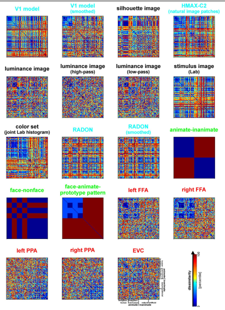
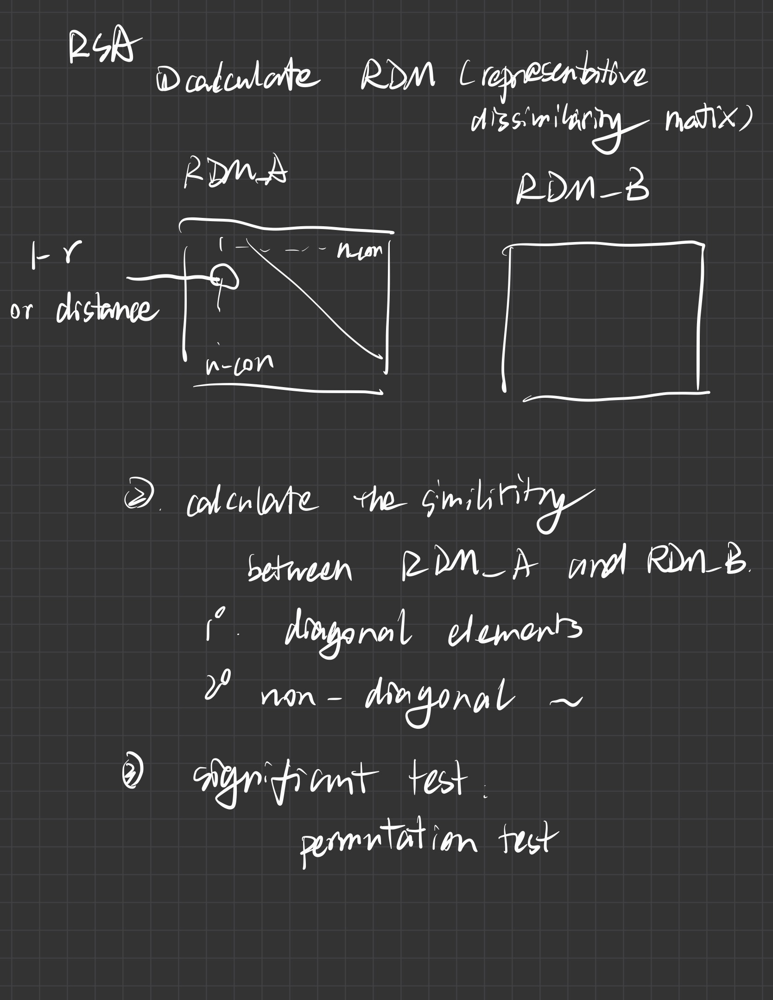

# Representational Similarity Analyses 

Dimsdale-Zucker, H. R., & Ranganath, C. (2018). Representational Similarity Analyses. *Handbook of Behavioral Neuroscience* (p509–525). Elsevier. <https://doi.org/10.1016/B978-0-12-812028-6.00027-6>

Lu, Z., & Ku, Y. (2020). NeuroRA: A Python Toolbox of Representational Analysis From Multi-Modal Neural Data. *Frontiers in Neuroinformatics*, *14*, 563669. <https://doi.org/10.3389/fninf.2020.563669>

Kriegeskorte, N. (2008). Representational similarity analysis – connecting the branches of systems neuroscience. *Frontiers in Systems Neuroscience*. <https://doi.org/10.3389/neuro.06.004.2008>

[TOC]

## Purpose

Representational similarity analysis (RSA) (Kriegeskorte et al., 2008) is an effective MVPA method that can successfully describe the relationship between representations of different data modalities, bridging gaps between humans, and animals.  

MVPA: Rather than focusing on the mean level of activity across a population of voxels as is done in traditional
approaches, multivoxel pattern analysis (MVPA) approaches focus on an examination of patterns of activity across voxels within the population 

- univariate analysis: The relevant question posed by univariate fMRI analysis is: “Does activation magnitude in [Brain area X] differ between  cond_A and cond_B
- Multivariate (MVPA): whether a brain area represents anything about **specific** events that are recollected.  

the goal of RSA is to test whether or not the observed (neural) representation matches an idealized or theoretical representation 

## Procedure

- Step 1 - calculate RDM (representation dissimilarity matrix)

RDM_A [n_con, n_con] and RDM_B [n_con, n_con]

behavioral data / fMRI data / EEG data

dissimilarity  = 1-correlation (Pearson correlation, Spearman correlation, Kendall’s tau
correlation, cosine similarity) or dissimilarity  = Euclidean distance 

"构建RDM时没有对结果的统计学的影响"

e.g.,

in which the animate-inanimate matrix represents the overall two general conditions (face vs object)

other matrix represents specific small conditions

color set : 参数化地操纵刺激维度，比如色调、亮度以及线条的朝向等等并测量视觉皮层的表征敏感度。在社会神经科学领域，很多刺激也可以维度化分解。

- Step 2 - compare two RDMs

calculate similarity (correlation) between the diagonal elements or non-diagonal elements

- Step 3 - significant test

permutation test: randomize the rank of elements in the matrix

## Meaning

RSA provides a novel way of observing big data, which is powerful in the field of cognitive neuroscience.  

It has been particularly useful in moving the field forward from localization of processes within regions to understanding how these regions represent information.  

RSA is a valuable tool for bridging the gap between human fMRI and invasive recording studies in animal models  

<ul class="actions">
<li><a href="https://www.lijinzhang.xyz/blog_200520_summary.html" class="button">Return</a></li>
</ul>			

