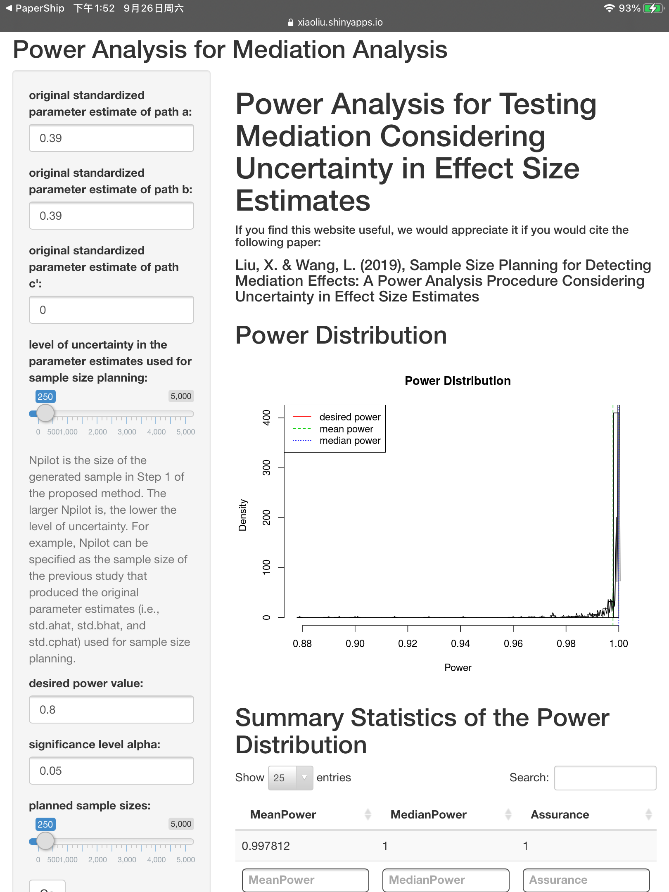

# Sample Size Planning for Detecting Mediation Effects: A Power Analysis Procedure Considering Uncertainty in Effect Size Estimates 

Liu, X., & Wang, L. (2019). Sample Size Planning for Detecting Mediation Effects: A Power Analysis
Procedure Considering Uncertainty in Effect Size Estimates? *Structural Equation Modeling: A Multidisciplinary Journal, 54*(6), 822-839. DOI:  [10.1080/00273171.2019.1593814 ](https://doi.org/10.1080/00273171.2019.1593814 )

[TOC]

## Backgroud and Purpose

### Sample size planning

obtaining a confidence interval of a particular (e.g., narrow enough) width from  accuracy in parameter estimation (AIPE) perspective (Kelley, Darku, & Chattopadhyay, 2018; Kelley & Maxwell, 2003; Kelley & Rausch, 2006; Maxwell et al., 2008). 

Considering both estimation precision and study cost, one can optimize a utility function with Bayesian approaches for SSP (Lindley, 1997).  

Specify the effect size

- minimum parameter value of interest (MPVI; Kelley & Maxwell, 2012).  (lead to an unnecessarily large sample )
- estimates from previous studies of the same topic or pilot studies (e.g., Anderson et al., 2017). 

### Sample size planning for testing mediation

estimation method

- (1) Baron and Kenny’s causal-steps test (Baron & Kenny, 1986);

- (2) **joint significance test** (MacKinnon, Lockwood, Hoffman, West, & Sheets, 2002), in which the mediation effect is considered as statistically significant if the test of path a and the test of path b are both statistically significant;  **used in the current study**
- (3) Sobel first-order test (Sobel, 1982); 
- (4) PRODCLIN test (MacKinnon, Fritz, Williams, & Lockwood, 2007); 
- (5) the percentile bootstrap test(Shrout & Bolger, 2002), in which a confidence interval for ab is obtained using bootstrapping and a statistically significant mediation is indicated by the exclusion of 0 in the confidence interval; and 
- (6) the bias-corrected bootstrap test (Efron & Tibshirani, 1993; MacKinnon, Lockwood, & Williams, 2004; Preacher & Hayes, 2008; Shrout & Bolger, 2002).2

Previous simulation study

- recommended the joint significance test and the percentile bootstrap test, because these two tests were shown to have higher power for detecting mediation effects and well-controlled Type I error rates. 
- The bias-corrected bootstrap test, a historically recommended test, had the highest power according to their simulation results. However, it has been shown to have inflated Type I error rates.

sample size planning for complex mediation method

- multiple mediator model: Boulton, and Short (2017) provided a convenient tool3 for power analysis using Monte Carlo confidence intervals. 
- longitudinal mediation studies, Pan, Liu, Miao, and Yuan (2018) showed that the distribution of the product method and the bootstrapping method have superior performance to Sobel’s method via simulations. 

Literature survey of the methods used for sample size planning for mediator models: (just) examined articles published in Psychological Science  

### Uncertainty in effect size for sample size planning

Effect size estimates vary from sample to sample due to sampling variability. 

How to handle uncertainty:

- In t-test or ANOVA: Perugini, Gallucci, and Costantini (2014) proposed the safeguard power analysis and used the lower boundary of the confidence interval surrounding an effect size estimate to perform power analysis.  
- GLM: Taylor and Muller (1996) proposed to use truncated noncentral F distributions to adjust for both uncertainty and bias in the point effect size estimates for power analysis 
- Based on Taylor and Muller (1996), Anderson et al. (2017) introduced a sample size planning approach that accounts for both bias and uncertainty in effect size estimates, and demonstrated it with t-test and ANOVA for several frequently used experimental designs. An R package (BUCSS) and Web applications 
- McShane and Bockenholt ( € 2016) proposed a power-calibrated effect size (PCES) approach 
- In Du & Wang (2016), a hybrid Bayesian power analysis procedure was proposed 

Difficulties in mediation models

do not has a monotonic relationship with the magnitude of the univariate effect size 

e.g., Fritz et al. (2012), their simulation studies found that as the size of the effect of X on M (i.e., path a) increased, power for testing the mediation effect H0 : ab = 0 could stagnate or even decline for a fixed value of b; 

e.g., For a fixed size of the mediation effect ab, power can vary from high (e.g., >0.8) to low (e.g., <0.2) because of the different possible combinations of a and b values. 

Purpose: propose a method for handling uncertainty in effect size of mediation models

## The Proposed method

- Generate K (in their shinyapp: K=1000) random samples of {X, M, Y} of size N pilot from the standardized simple mediation model with the parameters being the original standardized parameter estimates a researcher has 
- Fit the simple mediation model to each of the K generated samples to obtain K sets of new parameter estimates. The ordinary least squares (OLS) method is used for model estimation, which does not require distributional assumptions for the data. 
- Based on each of the K sets of new parameter estimates from Step 2, obtain a power value for detecting mediation with a planned sample size value denoted by N_plan. The Monte Carlo simulation method (e.g., Zhang, 2014) can be used to obtain each power value. 
- Form a power distribution with the obtained K power values and compute summary statistics that are relevant to the goal of sample size planning (e.g., 8 mean power or 80% assurance for 0.8 power). 
- Repeat the above steps for a range of Nplan values. Select the smallest planned sample size that satisfies the sample size planning goal. 

## Simulation Study 1

Purpose: show the impact of uncertainty in effect size estimates on power of testing mediation 

N_plan is not the smallest planned sample size that satisfies the sample size planning goal. Instead, it is set at the sample size needed for 0.8 power without considering uncertainty

With the pre-defined N_plan, get the power distribution (step 4)

Manipulate: N_pilot, effect size of a / b

Evaluation: the mean power, the median power, the assurance for reaching 0.8 power or higher, and the skewness. 

Results:

- when uncertainty in effect size estimates is not considered (with pre-defined N_plan) in sample size planning for mediation analysis, the suggested sample size from conventional power analysis could lead to severely underpowered studies. 
- if the researcher repeats the mediation study many times, merely in approximately 36.3% of the times the researcher’s study would reach 0.8 
- power distributions obtained in this simulation study are in general negatively skewed: This could explain why most of the mean and median power values are below 0.80. 

## Simulation study 2

Purpose: Sample size recommendations for mediation analysis with uncertainty considered 

similar conditions as study 1, replace the fixed N_plan to the N_plan obtained through the proposed method

the sample size planning goal: having 80% assurance for 0.8 power  or  reaching 0.8 mean power 

## Empirical Examples

[shinyapp](https://xiaoliu.shinyapps.io/MediationPowerAnalysis/)

cannot realize step 5, need to specify the N_plan

R function (avabliabe at nd.psychstat.org)

rechplan(): can realize the step 5

powerdist(): need to specify the N_plan

Example:

## Discussion

advantages: enjoys the flexibility of accommodating effect size estimates obtained from various sources 

limitations and future research: 

- only can work when a single set of parameter estimates is available 
- extend the proposed approach for sample size planning using the AIPE framework in the future 
- not consider that effect size estimates may be biased because of publication bias 
- extend to other widely used mediation models, such as multiple mediator models, multilevel mediation models, and longitudinal mediation models 
- extend to Bayesian estimation since it has advantages in estimating mediation effects

Notes for application: the sample size planning goal: 

- no such gold standard appropriate to all studies. 
- An assurance curve (figure above) may help a researcher to have an idea about how assurance would change as
  the planned sample size changes. 
- researchers should report the achieved assurance level in addition to reporting the desired power value and the planned sample size value. 

## My Thoughts

can also be extend using the hybrid Bayesian power analysis procedure. Bayesian estimation may has advantages in handling uncertainty of effect size with priors.

Similar to the MPVI method, this method can also lead to an unnecessarily large sample when N_pilot is small.

<ul class="actions">
<li><a href="https://www.lijinzhang.xyz/blog_200520_summary.html" class="button">Return</a></li>
</ul>			

