# Shrinkage priors for Bayesian penalized regression

van Erp, S., Oberski, D. L., & Mulder, J. (2019). Shrinkage priors for Bayesian penalized regression. *Journal of Mathematical Psychology, 89*, 31-50. DOI: [10.1016/j.jmp.2018.12.004](https://doi.org/10.1016/j.jmp.2018.12.004)

[toc]

## Backgroud

"The central idea of penalized regression approaches is to add a penalty term to the minimization of the sum of squared residuals, with the goal of shrinking small coefficients towards zero while leaving large coefficients large"

Advantages of Bayesian regularization method

- can be straightforwardly achieved by choosing a specific parametric form for the prior.
- parameter uncertainty and standard errors follow naturally from the posterior standard deviations. Whereas classical penalized regression procedures can result in estimated standard errors that suffer from multiple problems, such as variances estimated to be 0 (in the case of sandwich estimates), and unstable or poorly performing variance estimates (in the case of bootstrap estimates). 
- it is possible to estimate the penalty parameter(s) λ simultaneously with the model parameters
- More flexibility: Bayesian penalization relies on Markov Chain Monte Carlo (MCMC) sampling rather than optimization, which provides more flexibility in the sense that priors that would correspond to non-convex penalties (i.e., q < 1 in (1)) are easier to implement. 
  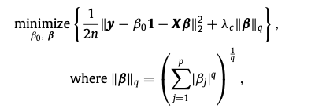
- Bayesian estimates have an intuitive interpretation.  For example, a 95% Bayesian credibility interval can simply be interpreted as the inter- val in which the true value lies with 95% probability (e.g., Berger, 2006).

worth-reading

Andersen, M. R., Vehtari, A., Winther, O., & Hansen, L. K. (2017). Bayesian inference for spatio-temporal spike-and-slab priors. Journal of Machine Learning Research (JMLR), 18(139), 1–58.

van Erp, S., Mulder, J., & Oberski, D. L. (2018). Prior sensitivity analysis in default bayesian structural equation modeling. Psychological Methods, 23(2), 363–388.

Zhao, S., Gao, C., Mukherjee, S., & Engelhardt, B. E. (2016). Bayesian group factor analysis with structured sparsity. Journal of Machine Learning Research (JMLR), 17(196), 1–47.

## Bayesian Penalized Regression

R package bayesreg, available from https://github.com/sara-vanerp/bayesreg

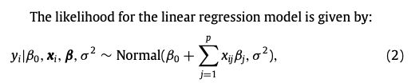

Note that the prior for β is conditioned on the residual variance σ 2 , as well as on λ (shrinkage parameter). The conditioning on σ 2 is necessary in certain cases to obtain a unimodal posterior (Park & Casella, 2008).

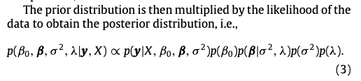

### How to choose shrinkage parameter

Full Bayes: 

- Treat λ as an unknown model parameter for which a prior needs to be specified. Typically, a vague prior p(λ) is specified for λ. 

- The advantage of this approach is that the model can be estimated in one step. 
- Throughout this paper, we will consider the half-Cauchy prior on λ, i.e., λ ∼ half-Cauchy(0, 1), which is a robust alternative and a popular prior distribution in the Bayesian literature (see e.g., Gelman, 2006; Mulder & Pericchi, 2018; Polson & Scott, 2012).

Empirical Bayes

- first estimate the penalty parameter λ from the data (In order to obtain an EB estimate for λ, we need to find the solution that maximizes the marginal likelihood) and then plug in this EB estimate for λ in the model

Cross-validation

- the prediction mean squared error (PMSE) is used to determine λ
- often used in frequentist methods, can also be used in Bayesian approach (see for example the loo package in R; Vehtari, Gabry, Yao, & Gelman, 2018).

A possible disadvantage of empirical Bayes and cross-validation is that the (marginal) likelihood can be flat or multimodal when there are multiple penalty parameters. -- use λ ∼ half-Cauchy(0,10000) to ensure a stable MCMC sampler

### Shrinkage Methods (Priors)

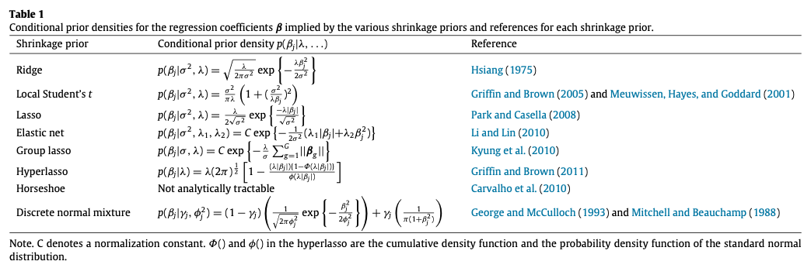

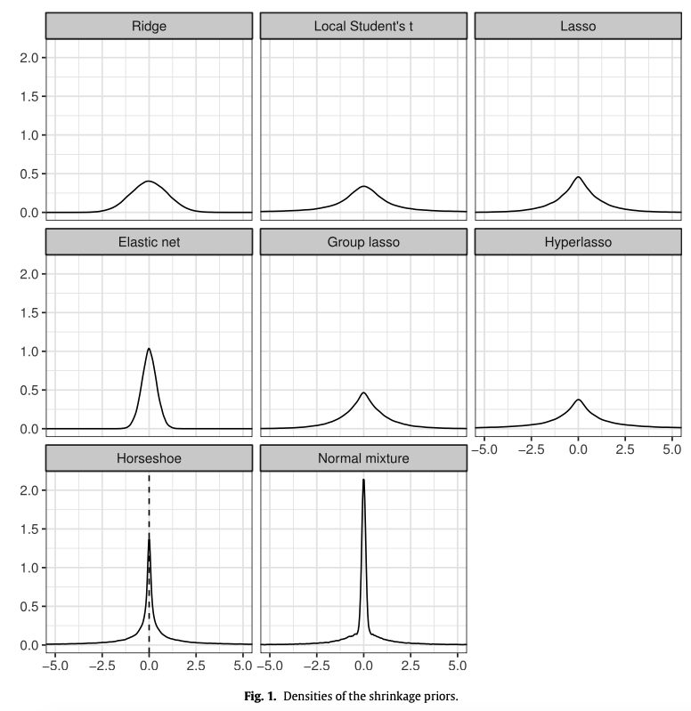

#### Ridge

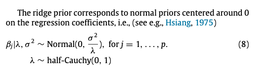

#### Local Student's t

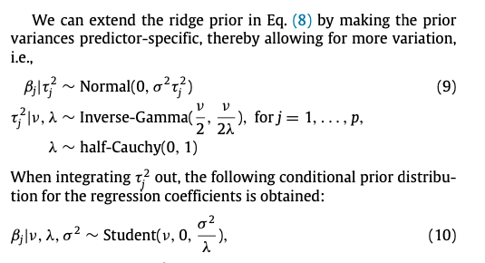

with ν = 1 implying a Cauchy prior for βj.

Compared to the ridge prior in (8), the local Student’s t prior has heavier tails. Throughout this paper, we will consider ν = 1, such that the prior has Cauchy-like tails.

#### Lasso

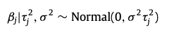

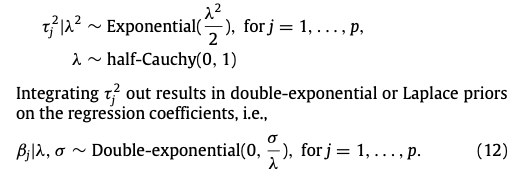

In addition to the overall shrinkage parameter λ, the lasso prior has an additional predictor-specific shrinkage parameter τj. Therefore, the lasso prior is more flexible than the ridge prior which only relies on the overall shrinkage parameter

**Disadvantages of the lasso**

- cannot select more predictors than observations, which is problematic when p > n
- when a group of predictors is correlated, the lasso generally selects only one predictor of that group
- the prediction error is higher for the lasso compared to the ridge when n > p and the predictors are highly correlated
- it can lead to overshrinkage of large coef- ficients (see e.g., Polson & Scott, 2011)
- it does not always perform as well in terms of variable selection as if the true underlying model has been given (Fan & Li, 2001). The lasso only enjoys the oracle property under specific and stringent conditions (Fan & Li, 2001; Zou, 2006). 

Oracle property: 神域性， 1.模型选择相和性(consistency)；2.参数估计渐进正态性

**Variable Selection via Nonconcave Penalized Likelihood and its Oracle Properties，Jianqing Fan and Runze Li，JASA，2001.**

#### Elastic net

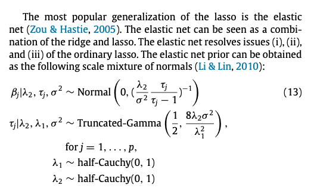

Specifically,thetwopenaltyparameters λ1 and λ2 determine the relative influence of the lasso and ridge penalty, respectively. 

a disadvantage of the classical elastic net is that the sequential cross-validation procedure used to determine the penalty parameters results in overshrinkage of the coefficients.This problem is resolved in the Bayesian approach.

#### Group Lasso

improving performance when predictors are grouped in some way

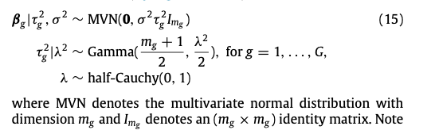

If there is no grouping structure, mg = 1

#### Hyperlasso

Zou (2006) proposes the adaptive lasso as a generalization of the lasso that enjoys the oracle property

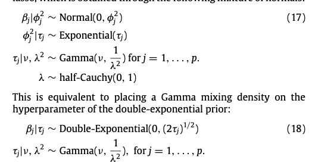

Note that the density of the hyperlasso prior strongly resembles the density of the lasso prior (Fig. 1), the main difference being that the hyperlasso has heavier tails than the lasso.

FollowingGriffin and Brown (2011), we will consider the specific case of ν = 0.5.

#### Horseshoe

a global-local shrinkage prior

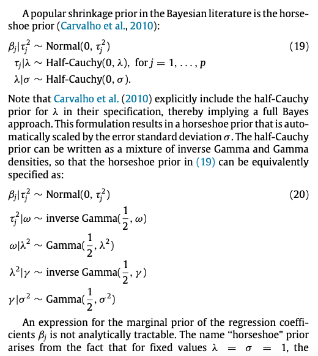

Large coefficients will lead to a shrinkage coefficient κj that is close to zero such that there is practically no shrinkage, whereas small coefficients will have a κj close to 1 and will be shrunken heavily.

horseshoe prior is the only prior with an asymptote at zero

Polson, N. G., & Scott, J. G. (2012). On the half-cauchy prior for a global scale parameter. Bayesian Analysis, 7(4), 887–902.

#### Regularized Horseshoe

(Piironen & Vehtari, 2017)

the posterior means of the regression coefficients might not exist and even if they do, the horseshoe prior can result in an unstable MCMC sampler

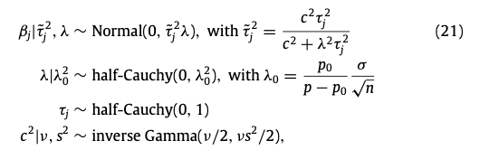

large coefficients will be shrunken towards zero by a Student’s t distribution with ν degrees of freedom and scale s2.  Piironen and Vehtari (2017) use a Student’s t distribution with ν = 4 and s2 = 2 

 #### Discrete normal mixture (spike and slab)

a discrete mixture of a peaked prior around zero (the spike) and a vague proper prior (the slab);

Based on the data, regression coefficients close to zero will be assigned to the spike, resulting in shrinkage towards 0, while coefficients that deviate substantially from zero will be assigned to the slab, resulting in (almost) no shrinkage. 

#### contour plot

等高线图 provide an insightful way to illustrate the be- havior of classical penalties and Bayesian shrinkage priors.

## Simulation Study

#### Evaluation

The optimal credibility interval is selected using the distance criterion (see e.g., Perkins & Schisterman, 2006): $sqrt((1-correct\_inclusion\_rate)^2+(false\_inclusion\_rate)^2)$

For the selected credibility interval, we will report Matthews’ correlation coefficient (MCC; Matthews, 1975)

convergence (threshold of PSR: 1.1), prediction accuracy (PMSE)

## My Thoughts

Half-Cauchy prior for the prior variance in Bayesian measurement invariance analysis

How to choose between many regularization methods? cross-validation method with RMSE, BIC...(similar to the method for choosing shrinkage parameter in frequentist regularization method) ?

**quality of classification**  --  think in the perspective of machine learning.

Is this bayesreg package built on Stan? -- build Bayesian regsem package based on blavaan which is built on JAGS

<ul class="actions">
<li><a href="https://www.lijinzhang.xyz/blog_200520_summary.html" class="button">Return</a></li>
</ul>			

