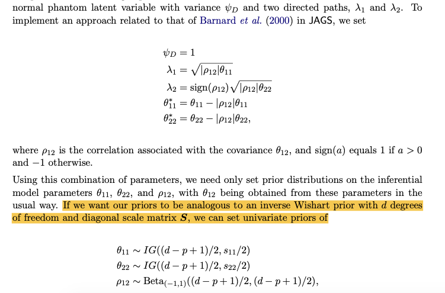
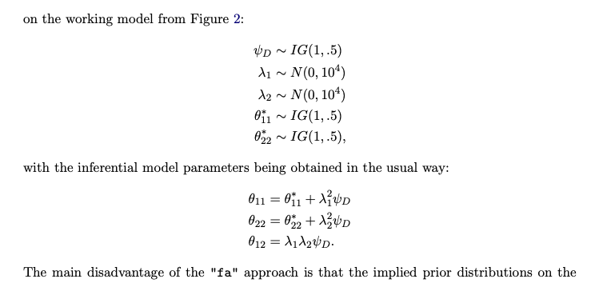
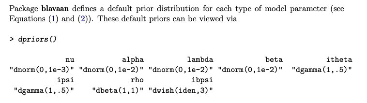
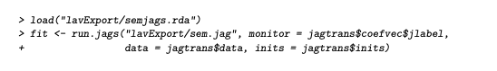

# blavaan: Bayesian Structural Equation Models via Parameter Expansion

Merkle, E. C. , & Rosseel, Y. . (2018). blavaan: bayesian structural equation models via parameter expansion. *Journal of statistical software, 85*(4), 1-30.

[TOC]

## blavaan

BSEM based on JAGS and runjags (now also based on stan)

other factor analysis samplers: bfa, MCMCpack.    brms

If one is restricted to conjugate priors, then the Song and Lee (2012) or Muth ́en and As- parouhov (2012) procedures are often available for simple MCMC estimation of the above model. However, if one wishes to use general priors or to estimate novel models, then there is the choice of implementing a custom MCMC scheme or using a general MCMC program like BUGS, JAGS, or Stan (Stan Development Team 2014). 

### Prior for the disturbance covariances

Lee (2007) assumes that the manifest variable covariance matrix Θ and the endogenous latent variable covariance matrix Ψ are diagonal. 


The background of the propose of parameter expansion method: Correlated residuals pose a difficult problem for MCMC methods because they often result in covariance matrices with some (but not all) off-diagonal entries equal to zero. In this situation, we cannot assign an inverse Wishart prior to the full covariance matrix because this does not allow us to fix some off-diagonal entries to zero. 

Mplus's solution the this problem: To address the issue of non-diagonal covariance matrices, Muth ́en and Asparouhov (2012) implemented a random walk method that is based on work by Chib and Greenberg (1998). This method samples free parameters of the covariance matrix via Metropolis-Hastings steps.

Mplus's solution's problem: While the implementation is fast and efficient, it does not allow for some types of equality constraints because parameters are updated in blocks (either all parameters in a block must be constrained to equality, or no parameters in a block can be constrained).


parameter expansion method

Our approach here is related to that of Palomo et al. (2007), who employ phantom latent variables (they use the term pseudo-latent variable) to simplify the estimation of mod- els with non-diagonal Θ matrices.



My example JAGS code for the disturbance covariances between three factors

```{r}


######################################################################
# Specify the (prior) distribution for the latent variables
######################################################################
for (i in 1:n){
  
  kappa[i,1] <-  mu.f[1] + inprod(dat[i,(J+1):(J+P)], beta[1:P,1]) + lambda.d[1,2]*phantom.d[i,1] + lambda.d[1,3]*phantom.d[i,3]
  kappa[i,2] <-  mu.f[2] + inprod(dat[i,(J+1):(J+P)], beta[1:P,2]) + lambda.d[2,1]*phantom.d[i,1] + lambda.d[2,3]*phantom.d[i,2]
  kappa[i,3] <-  mu.f[3] + inprod(dat[i,(J+1):(J+P)], beta[1:P,3]) + lambda.d[3,1]*phantom.d[i,3] + lambda.d[3,2]*phantom.d[i,2]

  
  ## phantom.d  1: f1 with f2, 2: f2 with f3, 3: f1 with f3
  phantom.d[i,1] ~ dnorm(0,1)
  phantom.d[i,2] ~ dnorm(0,1)
  phantom.d[i,3] ~ dnorm(0,1)
  
  for (z in 1:Z){
  ksi[i,z] ~ dnorm(kappa[i,z], 1/psi.star[z,z])  # distribution for the latent variables
  }
}


psi.star[1,1] <- psi[1,1] - abs(rho[1])*psi[1,1] - abs(rho[3])*psi[1,1]
psi.star[2,2] <- psi[2,2] - abs(rho[1])*psi[2,2] - abs(rho[2])*psi[2,2]
psi.star[3,3] <- psi[3,3] - abs(rho[2])*psi[3,3] - abs(rho[3])*psi[3,3]
#psi.star[2,2] <- psi[2,2] - ((-1 + 2*step(rho[1]))*sqrt(abs(rho[1])*psi[2,2]))^2 - (sqrt(abs(rho[2])*psi[2,2]))^2
#psi.star[3,3] <- psi[3,3] - ((-1 + 2*step(rho[2]))*sqrt(abs(rho[2])*psi[3,3]))^2 - ((-1 + 2*step(rho[3]))*sqrt(abs(rho[3])*psi[3,3]))^2

lambda.d[1,2] <- sqrt(abs(rho[1])*psi[1,1])
lambda.d[2,1] <- (-1 + 2*step(rho[1]))*sqrt(abs(rho[1])*psi[2,2])
lambda.d[1,3] <- sqrt(abs(rho[3])*psi[1,1])
lambda.d[3,1] <- (-1 + 2*step(rho[3]))*sqrt(abs(rho[3])*psi[3,3])
lambda.d[2,3] <- sqrt(abs(rho[2])*psi[2,2])
lambda.d[3,2] <- (-1 + 2*step(rho[2]))*sqrt(abs(rho[2])*psi[3,3])

for (z in 1:Z){
psi[z,z] <- 1/inv.psi[z]
inv.psi[z] ~ dgamma(1, 0.5)

## assign a beta distribution with support on (-1, 1) instead of the default (0, 1)
rho[z] <- -1 + 2*rho.new[z] 
rho.new[z] ~ dbeta(1,1)

mu.f[z] <- 0
}

# Inferential covariances
psi[1,2] <- lambda.d[1,2]*lambda.d[2,1]*1
psi[1,3] <- lambda.d[1,3]*lambda.d[3,1]*1
psi[2,3] <- lambda.d[2,3]*lambda.d[3,2]*1

  
d <- Z+1
p <- Z
```


this method can only be realized in JAGS (the previous default setting of blavaan-2018), the following method can also be realized in stan (the current default setting-2020)




The main disadvantage of the "fa" approach is that the implied prior distributions on the inferential model parameters are not of a common form. Thus, it is difficult to introduce informative prior distributions for the inferential model variance/covariance parameters. For example, the prior on the inferential covariance (θ12) is the product of two normal prior dis- tributions and an inverse gamma, which can be surprisingly informative. To avoid confusion here, we do not allow the user to directly modify the priors on the working parameters λ1, λ2, and ψD under the "fa" approach. 

While we prefer the "srs" approach to covariances between observed variables, the "fa" approach may be useful for complex models that run slowly. 


Beyond these options, the package attempts to identify when it can sample latent variables directly from a multivariate normal distribution, which can improve sampling efficiency. This most commonly happens when we have many exogenous latent variables that all covary with one another. In this case, we place an inverse Wishart prior distribution on the latent variable covariance matrix.

(But I didn't see it happens even when I estimate the whole factor variance-covarnace matrix..)

### other features of blavaan

#### model fitting: fitMeasures()

- posterior predictive checks of the model’s log-likelihood (e.g., Gelman, Carlin, Stern, and Rubin 2004).
- the Deviance Information Criterion (DIC; Spiegelhalter, Best, Carlin, and Linde 2002), the (Laplace-approximated) log-Bayes factor, the Widely Applicable Information Criterion (WAIC; Watanabe 2010), and the leave-one-out cross-validation statistic (LOO; e.g., Gelfand 1996).

blavaan calculates the likelihood separately after parameters have been sampled in JAGS.

The latter two statistics are computed by R package loo (Vehtari, Gelman, and Gabry 2015b), using output from blavaan.


#### default priors




#### convergence

Package blavaan offers two methods for monitoring chain convergence, specified as the "auto" or "manual" options to the convergence argument. 

Under "auto" convergence, chains are sampled for an initial period in order to (i) achieve convergence as determined by the Potential Scale Reduction Factor (PSRF; Gelman and Rubin 1992) and (ii) determine the number of samples necessary to obtain precise posterior estimates.  based on the autorun.jags() function

Under "manual" convergence, the user can specify the desired number of adaptation, burnin, and sample iterations via arguments of the same name (with defaults of 1,000 adaptation iterations, 4,000 burnin iterations, and 10,000 sample iterations).


#### initial values

The initial values of a fitted model can be obtained via blavInspect(); i.e.,

\> myinits <- blavInspect(fit, "inits")


#### modify the default jags code and reestimate the model



### Measurement invariance


## My Thoughts

#### Problem of the parameter expansion method

```{r}
My "I have read your paper "blavaan: Bayesian SEM via parameter expansion" and the proposed method attracts me. However, I am wondering what would happen if the sum of \rho larger than one (since \psi* = \psi(1- sum(\rho)), under this condition, the \psi* would be negative)? For example, for a MIMIC model with disturbance covariances among three factors are larger than 0.5."

Dr. Merkle "You are right that this parameter expansion approach does not work for all models. In case psi* is negative, then JAGS will crash. For example:

library(blavaan)

HS.model <- ' visual  =~ x1 + x2 + x3 + x4
              x1 ~~ .35*x2
              x1 ~~ .35*x3
              x1 ~~ .35*x4 '

## error:
m1 <- bsem(HS.model, data=HolzingerSwineford1939, target='jags')


I don't see that happen in many models, but it is possible. The new default, target="stan", does not use parameter expansion and would work:

m1 <- bsem(HS.model, data=HolzingerSwineford1939, burnin=100, sample=100, target='stan')

But there is still a problem with the prior distributions for the covariance matrix there. That covariance matrix is decomposed into correlations and standard deviations. Then each standard deviation gets a gamma prior, and each free correlation gets a beta prior. But that combination of priors can lead to non-positive definite covariance matrices, so we have to qualify the prior distributions by "subject to the resulting covariance matrix being positive definite".

It is easy to use inverse wishart or lkj on a covariance matrix with all free parameters, but tricky to handle a covariance matrix with some fixed 0s. For example, imagine the model above, but the parameters fixed to .35 are free:

blavInspect(m1, "est")$theta

I am trying to find a user-friendly solution here (maybe something related to lkj) and would be happy to hear any ideas.
"

My "I am wondering maybe the problem of the parameter expansion method is caused by the non-zero correlation between the high-level factors, that is, phantom variables. Taking the HS.model as an example, phantom variable d12 which is correlated with x1 maybe also correlated with d13. In this way, the untennable orthogonal hypothesis of phantom variables when calculating the psi* can result in the negative psi*."

Dr. Merkle "Yes, that might help: if we allow phantom variables to be correlated, perhaps we can avoid negative psi*. 

The tricky question is then how to choose a prior for the phantom variable correlations/covariances. Most blavaan users wouldn't be able to specify those priors, because they don't understand phantom latent variables and how the phantom variables are related to their desired model. This is why I defined the "psi*" variable the way that I did, so that users only had to specify priors for the original model parameters. But there might be a better way to do this.
"
```


<center>
<ul class="actions">
<li><a href="https://www.lijinzhang.xyz/blog_200520_summary.html" class="button">Return</a></li>
</ul>			
</center>